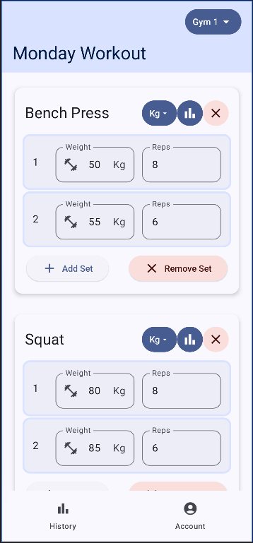
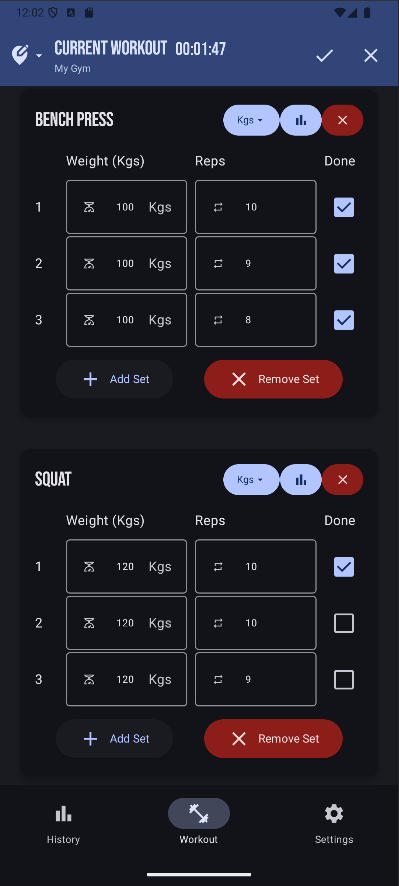
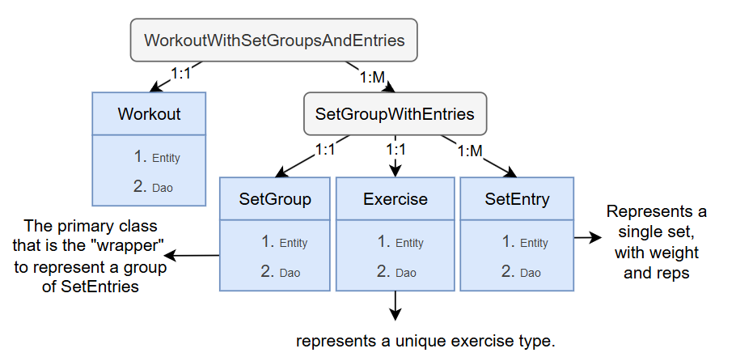
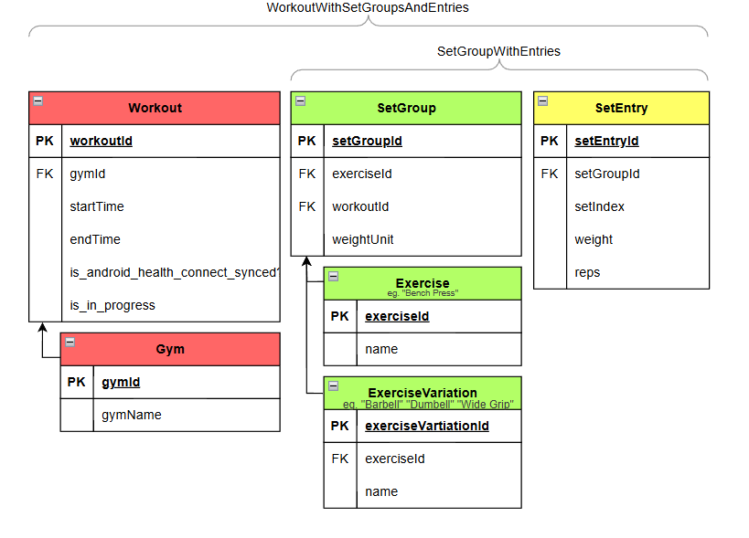

# Barebones Fitness Application - WorkoutLog  

This is a fitness application made using Android Studio, and Jetpack Compose. See the full planning document [here](docs/planning_document.pdf), and the final reflection document [here](docs/reflection.pdf). A key feature of this application is its ability so sync with [Android Health Connect](https://health.google/health-connect-android/).

Below is a view of the primary screen in the application

## Database Design

This application uses a structured database to efficiently manage workouts and exercises.

- **Database Overview:**  
    

- **Table Structure:**  
    The following diagram illustrates the Room database tables. All tables except `ExerciseVariation` have been implemented.  
    

